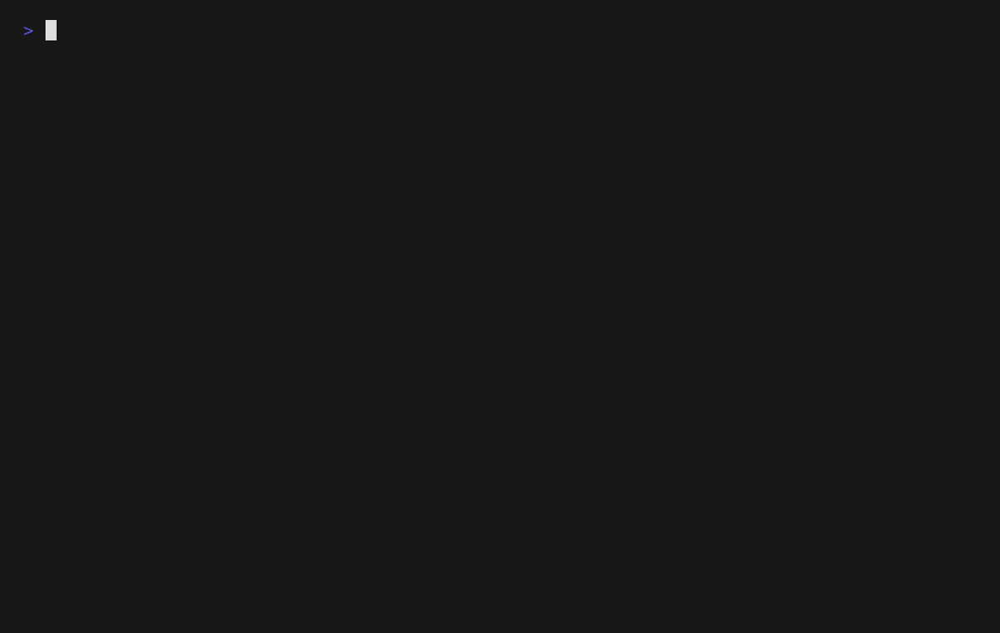

baeru
===

Make existing terminal commands look excessive on purpose.

## About

`baeru` is a Rust wrapper for existing terminal applications and command output.
It adds animation, color transformation, highlight reactions, and command-specific input behavior without patching the target application itself.

It is intentionally not a minimal utility.
The goal is to take existing commands like `htop`, `lazygit`, `ls`, or `journalctl` and make them feel theatrical.

At the moment, `baeru` focuses on:

- cinematic TUI startup reveals
- live ANSI recoloring
- per-command key remapping
- inline animation for ordinary CLI output
- regex-driven highlight reactions
- profile-driven behavior from `baeru.yml`

> [!NOTE]
> `baeru` is still a PoC, but the project direction is clear:
> this repository is for making existing commands louder, flashier, and more animated.

### Releated project

This repository focuses on expressiveness.
While the ability to wrap and modify existing TUI applications has many potentials, this application focuses on "making existing TUI applications more flashy."
We have also prepared another repository for testing more practical features, so please check that out as well if you're interested.

- `baeru`
  Built for animation, showy wrapping, and command-level visual experiments
- [`twrap`](https://github.com/blacknon/twrap)
  A more practical TUI-focused extraction for the terminal wrapping layer itself

If you want the production-oriented TUI wrapper path without the whole "make it glow" direction, `twrap` is the place to look.

## First look

### TUI reveal + live color


```yaml
profiles:
  - name: htop-jirai-pink
    match:
      command: htop
    backend: tui
    features:
      - reveal
      - live_color
    effect: coalesce
    effect: scatter
    theme_file: examples/themes/jirai-pink.yml
    capture_ms: 360
    duration_ms: 1120
    frames: 24
```

### TUI reveal + live color + live rendor + realtime masking + highligh text + charactor fade


```yaml
profiles:
  - name: htop-jirai-pink
    match:
      command: htop
    backend: tui
    features:
      - reveal
      - live_color
      - live_render
    effect: scatter
    animation_color_fade: true
    animation_color_darken_factor: 0.02
    live_render_duration_ms: 620 # The fade is slowed down to make it easier to see.
    live_render_mouse_quiet_ms: 280
    theme_file: examples/themes/jirai-pink.yml
    capture_ms: 360
    duration_ms: 1120
    frames: 24
```

### CLI inline animation + theme


```yaml
  - name: ls-inline
    match:
      command: ls
    backend: cli
    features:
      - inline_animation
    effect: coalesce
    theme_file: themes/matrix-green.yml
    cli_settled_color: "#b6ffd0"
    cli_gradient_start: "#004d26"
    cli_gradient_end: "#eafff2"
    duration_ms: 900
    frames: 20
```


### CLI inline animation + charactor fade



```yaml
  - name: neofetch-fade
    match:
      command: neofetch
    backend: cli
    features:
      - inline_animation
    animation_color_fade: true
    animation_color_darken_factor: 0.02
    live_render_duration_ms: 120
    live_render_mouse_quiet_ms: 280
    duration_ms: 900
    frames: 18
```

## What `baeru` is for

Many terminal customization ideas fall into one of two extremes:

- patch or fork the target application
- build a brand-new terminal UI from scratch

`baeru` explores a third path: keep the original app, but wrap it with presentation and interaction layers.

That makes room for things like:

- startup reveals that make `htop` and `lazygit` feel staged
- theme-driven ANSI recoloring without patching the target app
- `highlight` effects that blink and react to matching output
- CLI animations that make plain command output settle into place
- output transforms that mask or replace visible text while keeping the original command untouched

## What it can do

### TUI drama

- `reveal`
  Captures the startup screen, animates it, then hands control back to the original TUI
- `live_color`
  Rewrites ANSI colors live, including indexed palette replacement
- `keymap`
  Applies per-command input remapping from YAML
- `live_render`
  Rebuilds TUI state and animates dirty cells during updates

### CLI drama

- `inline_animation`
  Animates ordinary stdout with effects like `coalesce`, `glitch`, `matrix`, and `sweep`
- `highlight`
  Watches for matching text and reacts with styled emphasis, blinking, captures, and hooks
- `replace` / `mask`
  Rewrites only the visible output layer, useful for demos and screenshots

## Quick start

The fastest way to get the vibe:

```bash
cargo run -- htop
cargo run -- lazygit
cargo run -- ls -la
cargo run -- -b cli -e '(?i)error|timeout' journalctl -n 50
```

More explicit examples:

```bash
cargo run -- -m reveal htop
cargo run -- -m color_live -t examples/themes/jirai-pink.yml htop
cargo run -- -m reveal -t examples/themes/jirai-pink.yml -k examples/keymaps/htop-vim.yml htop
cargo run -- -m live_render -t examples/themes/jirai-pink.yml htop
cargo run -- -b cli --effect matrix git status
cargo run -- -b cli -e '(?i)error' -e 'timeout' journalctl -n 50
cargo run -- -b cli -R '(?i)token=[A-Za-z0-9_]+' 'token=[redacted]' env
```

## Installation

### Release binaries

Prebuilt binaries are published on the GitHub Releases page.

- Linux: `x86_64-unknown-linux-gnu`
- macOS: `aarch64-apple-darwin`
- Windows: `x86_64-pc-windows-msvc`

Download an archive from Releases, then place `baeru` somewhere on your `PATH`.

### crates.io

If you already have a Rust toolchain installed, you can install from crates.io:

```bash
cargo install baeru
```

### Build from source

```bash
git clone https://github.com/blacknon/baeru
cd baeru
cargo build --release
./target/release/baeru htop
```

Useful short options include `-b` for `--backend`, `-m` for `--mode`, `-E` for `--effect`, `-c` for `--config-file`, `-t` for `--theme-file`, and `-k` for `--keymap-file`.

If no `--config-file` is given, `baeru` looks for config files in this order:

- `./baeru.yml`
- `$XDG_CONFIG_HOME/baeru/baeru.yml`
- `~/.config/baeru/baeru.yml`
- `~/.baeru.yml`

For example:

```bash
cargo run -- htop
cargo run -- ls -la
```

You can also point to a config explicitly:

```bash
cargo run -- -c baeru.yml htop
```

## Demo recipes

- `htop` with reveal + recolor + keymap
- `lazygit` with a faster startup reveal
- `journalctl` with match-driven highlights
- `git status` with animated settle effects
- `env` or `neofetch` with visible masking for recordings and screenshots

## Backends

### `tui`

For interactive terminal applications such as `htop` or `lazygit`.

```bash
baeru -b tui htop
baeru -m reveal htop
```

### `cli`

For ordinary commands such as `ls`, `df`, or `git status`.

```bash
baeru -b cli ls -la
baeru -b cli git status
printf 'hello\nworld\n' | baeru -b cli
```

### `raw`

For plain passthrough behavior without added effects.

## Features

### Current matrix

| Area | Name | Kind | Status | Notes |
| --- | --- | --- | --- | --- |
| TUI | `reveal` | startup animation | stable PoC | startup capture + animated reveal |
| TUI | `live_color` | live color transform | stable PoC | ANSI SGR rewrite, supports palette replacement |
| TUI | `keymap` | input remap | stable PoC | YAML-driven byte-sequence remapping |
| TUI | `splash` | startup animation | stable PoC | simple pre-launch splash |
| TUI | `live_render` | live redraw animation | experimental | VT100 rebuild + changed-cell flash |
| CLI | `inline_animation` + `coalesce` | inline animation | stable PoC | noisy symbols converge into final text |
| CLI | `inline_animation` + `glitch` | inline animation | stable PoC | flickery noisy instability that settles quickly |
| CLI | `inline_animation` + `matrix` | inline animation | stable PoC | column-biased digital-rain style convergence |
| CLI | `inline_animation` + `scanline` | inline animation | stable PoC | moving scan band reveals text as it passes |
| CLI | `inline_animation` + `scatter` | inline animation | stable PoC | randomized positions settle into place across the screen |
| CLI | `inline_animation` + `sweep` | inline animation | stable PoC | left-to-right reveal |
| CLI | `inline_animation` + `wipe` | inline animation | stable PoC | diagonal wipe from sparse to full text |
| CLI | `inline_animation` + `fade` | inline animation | stable PoC | delayed text appearance |
| CLI | `inline_animation` + `plain` | passthrough-style | stable PoC | same backend path, no animation |

### `reveal`

Starts the target command in a PTY, captures the initial screen briefly, renders a startup animation, then switches to PTY passthrough.

```bash
baeru --mode reveal htop
baeru --mode reveal --capture-ms 420 --duration-ms 900 htop
```

Sample GIFs:

**coalesce**


**sweep**


**fade**


**plain**


### `live_color`

Passes PTY output through while rewriting ANSI SGR colors.

```bash
baeru --mode color-live --theme-file examples/themes/jirai-pink.yml htop
```

Current approaches include:

- gradient-based recoloring
- indexed ANSI palette replacement via `palette_map`

### `keymap`

Rewrites key input per command using YAML-defined mapping rules.

### `inline_animation`

Animates CLI output inline below the prompt.

- Without a theme or CLI color override: animates while preserving the original ANSI colors
- With a theme or CLI color override: recolors output on the `baeru` side

Supported effects:

- `coalesce`
- `glitch`
- `matrix`
- `scanline`
- `scatter`
- `sweep`
- `wipe`

## Highlight rules

`baeru` can watch output for matching keywords or regular expressions and react to them.
In CLI mode, matches are colorized and can trigger hooks or captures.
In TUI rendering paths such as `reveal` and `live_render`, matches can also flash in place with side markers for a more aggressive alert feel.

CLI option:

```bash
baeru --backend cli -e '(?i)error' -e 'timeout' journalctl -n 50
baeru --backend cli -e '(?i)error' --highlight-capture-cli-text --highlight-command echo --highlight-command matched journalctl -n 50
```

- `-e`, `--highlight`
  - regex pattern, repeatable
- `--highlight-color`
  - default background color for CLI `-e` rules
  - default is yellow: `#ffff00`
- `--highlight-command`
  - command argv for CLI-defined highlight rules
  - repeat the option for each argv part
- `--highlight-capture-cli-text`
  - save full CLI text output when a CLI-defined highlight matches
- `--highlight-capture-tui-screenshot`
  - save a TUI SVG screenshot when a CLI-defined highlight matches
- `--highlight-output-dir`
  - output directory for CLI-defined highlight captures and manifests
- `--highlight-output-prefix`
  - filename prefix template for CLI-defined highlight captures and manifests
  - supported tokens: `{key}`, `{backend}`, `{capture_kind}`, `{ext}`, `{timestamp}`, `{env:NAME}`
  - rendered values are sanitized to safe filename characters

Config example:

```yaml
profiles:
  - name: journal-alerts
    match:
      command: journalctl
    backend: cli
    features:
      - inline_animation
    highlight_color: "#ffff00"
    highlight_rules:
      - key: error
        pattern: "(?i)error|failed|panic"
        color: "#ffcc00"
        capture_cli_text: true
        output_dir: ./baeru-artifacts
        output_prefix: "alerts-{backend}-{env:USER}-"
        command: ["sh", "-c", "printf '%s\n' \"$BAERU_HIGHLIGHT_EVENT_JSON\""]
```

`output_prefix` is optional for both CLI flags and `highlight_rules`. When set, it is prepended to generated filenames inside `output_dir`.

Example:

```bash
baeru --backend cli \
  -e '(?i)error' \
  --highlight-capture-cli-text \
  --highlight-output-dir ./baeru-artifacts \
  --highlight-output-prefix 'nightly-{backend}-{timestamp}-' \
  journalctl -n 50
```

Per match rule, `baeru` can:

- highlight matching text
- run a command
- write CLI output to a text file
- write a TUI screen snapshot as SVG

Triggered commands receive context through environment variables:

- `BAERU_HIGHLIGHT_BACKEND`
- `BAERU_HIGHLIGHT_KEY`
- `BAERU_HIGHLIGHT_PATTERN`
- `BAERU_HIGHLIGHT_MATCHES_JSON`
- `BAERU_HIGHLIGHT_EVENT_JSON`
- `BAERU_HIGHLIGHT_CAPTURE_PATH`
- `BAERU_HIGHLIGHT_CAPTURE_KIND`

## Replace and mask rules

`baeru` can also rewrite visible output without changing the underlying application.

CLI options:

```bash
baeru -b cli -R '(?i)token=[A-Za-z0-9_]+' 'token=[redacted]' env
baeru -b cli -M '(?i)password=.*' sh -c 'printf "password=hunter2\n"'
```

- `-R`, `--replace <PATTERN> <TEXT>`
  - regex-based visible replacement
  - repeatable
  - replacement is width-preserving
  - if replacement is shorter than the matched text, it is padded with spaces
  - if replacement is longer, only the leading characters are used
- `-M`, `--mask <PATTERN>`
  - regex-based masking
  - repeatable
- `--mask-char`
  - masking character
  - default is `*`

Config example:

```yaml
profiles:
  - name: fetch-safe
    match:
      command: neofetch
    backend: cli
    features:
      - inline_animation
    replace_rules:
      - pattern: "Debian GNU/Linux"
        replacement: "Distro"
    mask_rules:
      - pattern: "(?i)kernel: .*"
        mask_char: "#"
```

These transforms are applied to CLI output and to TUI rendering paths such as `reveal` and `live_render`.

```bash
baeru --backend cli --effect coalesce ls -la
baeru --backend cli --effect sweep git status
```

Sample GIFs:

**coalesce**


**sweep**


**fade**


### `live_render` experimental

Rebuilds the target TUI screen from VT100 state, redraws it from `baeru`, and animates changed cells during live updates.

```bash
baeru --mode live_render --theme-file examples/themes/jirai-pink.yml htop
```

This mode is still intentionally experimental, but it is no longer just a full-screen redraw toy.
Current improvements include:

- row-diff and dirty-row redraw instead of blind full-screen repaint
- simple scroll hints for vertical updates
- cursor visibility / cursor position restoration
- PTY resize propagation and parser recreation on terminal resize
- mouse / cursor-mode / bracketed-paste passthrough for better input fidelity
- short live update animation with `coalesce` / `glitch` / `matrix` / `scanline` / `scatter` / `sweep` / `wipe` / `fade` / `plain`

Recommended profile-style tuning:

```yaml
profiles:
  - name: htop-live-render-experimental
    match:
      command: htop-live
    backend: tui
    features:
      - live_render
      - keymap
    effect: coalesce
    keymap_file: examples/keymaps/htop-vim.yml
    live_render_duration_ms: 90
    live_render_mouse_quiet_ms: 180
    animation_color_fade: true
    animation_color_darken_factor: 0.22
```

`live_render_duration_ms` controls the short redraw animation window.
`live_render_mouse_quiet_ms` controls how long `baeru` stays in quieter redraw mode after wheel / drag / up-down style input.
`animation_color_fade` darkens characters before they settle to their target colors during `reveal` and `live_render`.

## Configuration

### `baeru.yml`

`baeru` resolves behavior from profiles matched against:

- executable basename
- exact executable path
- optional `args_prefix`

Example:

```yaml
profiles:
  - name: htop-jirai-vim
    match:
      command: htop
    backend: tui
    features:
      - reveal
      - live_color
      - keymap
    # omit `effect` to use the default TUI fade
    animation_color_fade: true
    animation_color_darken_factor: 0.22
    keymap_file: examples/keymaps/htop-vim.yml
    theme_file: examples/themes/jirai-pink.yml
    capture_ms: 360
    duration_ms: 720
    frames: 24

  - name: ls-inline
    match:
      command: ls
    backend: cli
    features:
      - inline_animation
    effect: coalesce
    theme_file: themes/matrix-green.yml

  - name: htop-live-render-experimental
    match:
      command: htop-live
    backend: tui
    features:
      - live_render
      - keymap
    effect: coalesce
    keymap_file: examples/keymaps/htop-vim.yml
    live_render_duration_ms: 90
    live_render_mouse_quiet_ms: 180
    animation_color_fade: true
    animation_color_darken_factor: 0.22
```

### Theme YAML

Themes support the original gradient-based recoloring style:

```yaml
name: jirai-pink
default_fg: "#ffcdeb"
default_bg: "#120018"
force_default: true
foreground:
  - { at: 0.00, color: "#84205c" }
  - { at: 0.30, color: "#ff45ac" }
  - { at: 0.62, color: "#ff8fd6" }
  - { at: 0.84, color: "#ffcdeb" }
  - { at: 1.00, color: "#fff2fa" }
background:
  - { at: 0.00, color: "#120018" }
  - { at: 0.55, color: "#570a41" }
  - { at: 1.00, color: "#ff8fcf" }
```

They also support indexed ANSI palette replacement:

```yaml
name: gundam-tricolor-htop
default_fg: "#f3f6ff"
default_bg: "#08111f"
force_default: true
palette_map:
  1: "#ff5a5f"
  3: "#ffd84a"
  4: "#3f7dff"
  15: "#ffffff"
background_palette_map:
  4: "#0f214a"
```

This is especially useful for `htop`-style TUIs where preserving rough semantic color roles matters more than pure luminance mapping.

### Keymap YAML

```yaml
keymap:
  j: down
  k: up
  h: left
  l: right
  ctrl-d: page-down
  ctrl-u: page-up
  r: f5
  "/": f3
```

Supported key names include:

- arrows: `up`, `down`, `left`, `right`
- navigation: `home`, `end`, `page-up`, `page-down`
- function keys: `f1` ... `f10`
- control keys: `ctrl-a` ... `ctrl-z`
- special keys: `enter`, `esc`, `tab`, `backspace`
- printable single characters such as `j`, `k`, `/`

## Themes

There are two theme buckets right now:

- `themes/`
  More baseline examples
- `examples/themes/`
  More expressive or experimental sample themes

Current example themes include:

- `jirai-pink`
- `eva-unit-01`
- `eva-unit-01-htop`
- `gundam-tricolor-htop`

## Keymaps

Example keymap files live under:

- `examples/keymaps/`

## Limitations

- This is still a PoC. Terminal restoration and signal handling can be hardened further.
- `reveal` captures a single approximate startup screen. Very unstable startup screens may need `capture_ms` tuning.
- `live_render` is experimental. It is more usable now, but complex TUIs may still flicker, briefly desynchronize, or lose some emulator-specific behavior.
- CLI inline animation is still less robust than plain passthrough for some terminals and very large outputs.
- Key remapping is byte-sequence based. Complex keyboard protocols and emulator-reserved shortcuts still need more careful handling.
- Mouse mapping is not implemented yet, though the architecture leaves room for a future `mousemap` layer.
- Command-specific semantic adapters are still future work.

## License

MIT. See [LICENSE](LICENSE).

## ASW-G-01?

> **?** "Here stands the truth of Gjallarhorn. All of you... gather beneath Bael!"
>
> **?** "It's Bael!"
>
> **?** "The soul of Agnika Kaieru!"
>
> **?** "That's the other Bael, it is Baeru"
