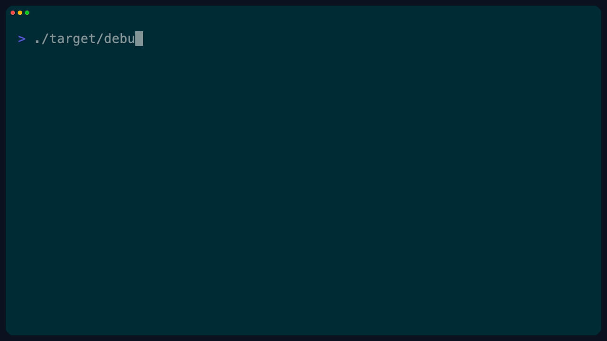
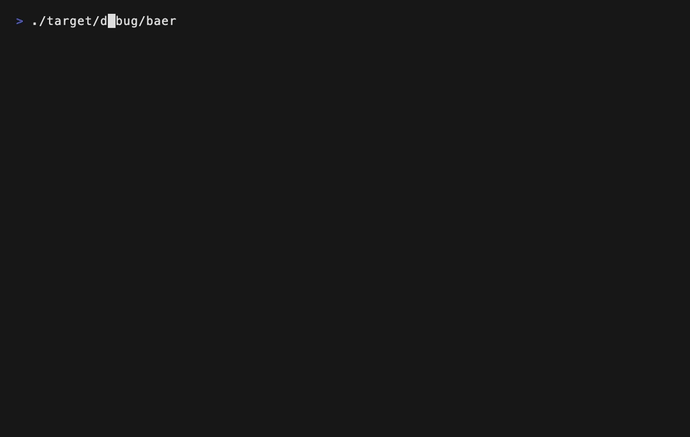
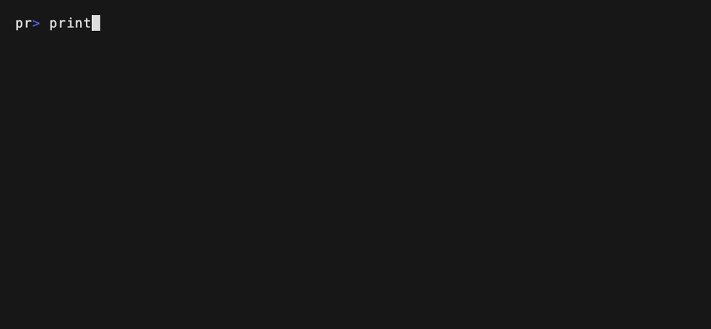
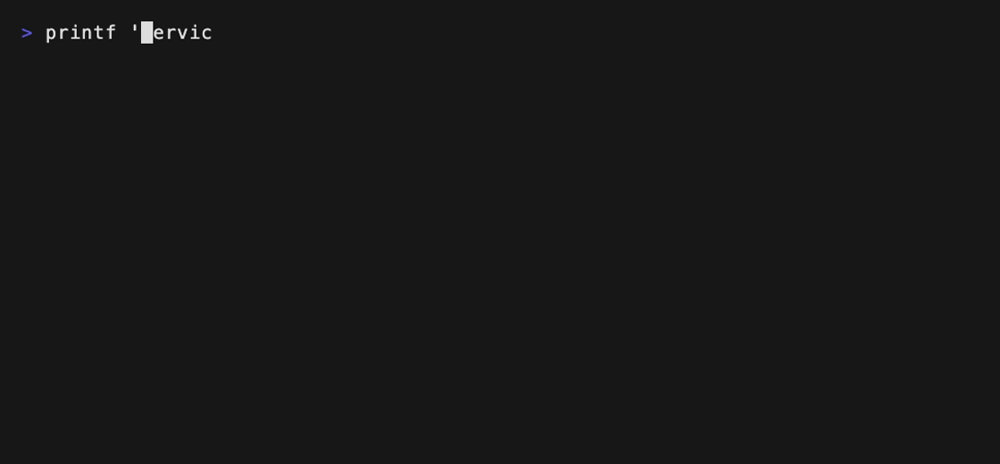
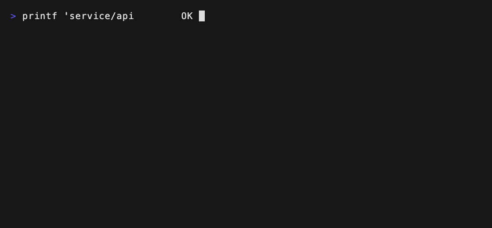

baeru
===

`baeru` is a Rust wrapper for existing terminal applications and command output.
It adds animation, color transformation, and command-specific input behavior without patching the target application itself.

At the moment, `baeru` focuses on:

- TUI startup reveal effects
- live ANSI color rewriting
- per-command key remapping
- inline animation for ordinary CLI output
- profile-driven behavior from `baeru.yml`

> [!NOTE]
> `baeru` is still a PoC, but the current codebase is already usable as a base for experiments around `htop`, `lazygit`, and animated CLI wrappers.

## Demo

### TUI reveal + live color


### CLI inline animation



## Why `baeru`

Many terminal customization ideas fall into one of two extremes:

- patch or fork the target application
- build a brand-new terminal UI from scratch

`baeru` explores a middle path: keep the original app, but wrap it with presentation and interaction layers.

That makes it possible to experiment with things like:

- cinematic startup reveals for TUIs
- theme-driven ANSI recoloring
- per-command keymaps
- lightweight animation for normal CLI output

## Core model

`baeru` is organized around two concepts:

- `backend`
  The execution path: `tui`, `cli`, or `raw`
- `features`
  Layered behaviors such as `reveal`, `live_color`, `keymap`, and `inline_animation`

This separation makes it easy to express profiles like:

- `htop` uses `reveal + live_color + keymap`
- `vim` stays close to passthrough
- `ls` uses CLI animation only

## Installation

### Release binaries

Prebuilt binaries are published on the GitHub Releases page.

- Linux: `x86_64-unknown-linux-gnu`
- macOS: `aarch64-apple-darwin`
- Windows: `x86_64-pc-windows-msvc`

Download an archive from Releases, then place `baeru` somewhere on your `PATH`.

### crates.io

If you already have a Rust toolchain installed, you can install from crates.io:

```bash
cargo install baeru
```

### Build from source

```bash
git clone https://github.com/blacknon/baeru
cd baeru
cargo build --release
./target/release/baeru -- htop
```

## Quick start

Run using the default profile lookup:

```bash
cargo run -- -- htop
cargo run -- -- lazygit
cargo run -- -- ls -la
```

Explicit examples:

```bash
cargo run -- --mode reveal -- htop
cargo run -- --mode color-live --theme-file examples/themes/jirai-pink.yml -- htop
cargo run -- --mode reveal --theme-file examples/themes/jirai-pink.yml --keymap-file examples/keymaps/htop-vim.yml -- htop
cargo run -- --mode live-render --theme-file examples/themes/jirai-pink.yml -- htop
cargo run -- --backend cli -- ls -la
cargo run -- --backend cli -- git status
```

If `./baeru.yml` exists, it is loaded automatically:

```bash
cargo run -- -- htop
cargo run -- -- ls -la
```

You can also point to a config explicitly:

```bash
cargo run -- --config-file baeru.yml -- htop
```

If no command is specified and stdin is a terminal, `htop` is used as the default PoC target:

```bash
cargo run
```

## Backends

### `tui`

For interactive terminal applications such as `htop` or `lazygit`.

```bash
baeru --backend tui -- htop
baeru --mode reveal -- htop
```

### `cli`

For ordinary commands such as `ls`, `df`, or `git status`.

```bash
baeru --backend cli -- ls -la
baeru --backend cli -- git status
printf 'hello\nworld\n' | baeru --backend cli
```

### `raw`

For plain passthrough behavior without added effects.

## Features

### Current matrix

| Area | Name | Kind | Status | Notes |
| --- | --- | --- | --- | --- |
| TUI | `reveal` | startup animation | stable PoC | startup capture + animated reveal |
| TUI | `live_color` | live color transform | stable PoC | ANSI SGR rewrite, supports palette replacement |
| TUI | `keymap` | input remap | stable PoC | YAML-driven byte-sequence remapping |
| TUI | `splash` | startup animation | stable PoC | simple pre-launch splash |
| TUI | `live-render` | live redraw animation | experimental | VT100 rebuild + changed-cell flash |
| CLI | `inline_animation` + `coalesce` | inline animation | stable PoC | noisy symbols converge into final text |
| CLI | `inline_animation` + `sweep` | inline animation | stable PoC | left-to-right reveal |
| CLI | `inline_animation` + `fade` | inline animation | stable PoC | delayed text appearance |
| CLI | `inline_animation` + `plain` | passthrough-style | stable PoC | same backend path, no animation |

### `reveal`

Starts the target command in a PTY, captures the initial screen briefly, renders a startup animation, then switches to PTY passthrough.

```bash
baeru --mode reveal -- htop
baeru --mode reveal --capture-ms 420 --duration-ms 900 -- htop
```

Sample GIFs:

**coalesce**


**sweep**



**fade**


**plain**


### `live_color`

Passes PTY output through while rewriting ANSI SGR colors.

```bash
baeru --mode color-live --theme-file examples/themes/jirai-pink.yml -- htop
```

Current approaches include:

- gradient-based recoloring
- indexed ANSI palette replacement via `palette_map`

### `keymap`

Rewrites key input per command using YAML-defined mapping rules.

### `inline_animation`

Animates CLI output inline below the prompt.

Supported effects:

- `coalesce`
- `sweep`
- `fade`
- `plain`

```bash
baeru --backend cli --effect coalesce -- ls -la
baeru --backend cli --effect sweep -- git status
```

Sample GIFs:

**coalesce**



**sweep**



**fade**



### `live-render` experimental

Rebuilds the target TUI screen from VT100 state, redraws it from `baeru`, and flashes changed cells.

```bash
baeru --mode live-render --theme-file examples/themes/jirai-pink.yml -- htop
```

This mode is intentionally experimental and much more fragile than `reveal` or `live_color`.

## Configuration

### `baeru.yml`

`baeru` resolves behavior from profiles matched against:

- executable basename
- exact executable path
- optional `args_prefix`

Example:

```yaml
profiles:
  - name: htop-jirai-vim
    match:
      command: htop
    backend: tui
    features:
      - reveal
      - live_color
      - keymap
    effect: coalesce
    keymap_file: examples/keymaps/htop-vim.yml
    theme_file: examples/themes/jirai-pink.yml
    capture_ms: 360
    duration_ms: 720
    frames: 24

  - name: ls-inline
    match:
      command: ls
    backend: cli
    features:
      - inline_animation
    effect: coalesce
    theme_file: themes/matrix-green.yml
```

### Theme YAML

Themes support the original gradient-based recoloring style:

```yaml
name: jirai-pink
default_fg: "#ffcdeb"
default_bg: "#120018"
force_default: true
foreground:
  - { at: 0.00, color: "#84205c" }
  - { at: 0.30, color: "#ff45ac" }
  - { at: 0.62, color: "#ff8fd6" }
  - { at: 0.84, color: "#ffcdeb" }
  - { at: 1.00, color: "#fff2fa" }
background:
  - { at: 0.00, color: "#120018" }
  - { at: 0.55, color: "#570a41" }
  - { at: 1.00, color: "#ff8fcf" }
```

They also support indexed ANSI palette replacement:

```yaml
name: gundam-tricolor-htop
default_fg: "#f3f6ff"
default_bg: "#08111f"
force_default: true
palette_map:
  1: "#ff5a5f"
  3: "#ffd84a"
  4: "#3f7dff"
  15: "#ffffff"
background_palette_map:
  4: "#0f214a"
```

This is especially useful for `htop`-style TUIs where preserving rough semantic color roles matters more than pure luminance mapping.

### Keymap YAML

```yaml
keymap:
  j: down
  k: up
  h: left
  l: right
  ctrl-d: page-down
  ctrl-u: page-up
  r: f5
  "/": f3
```

Supported key names include:

- arrows: `up`, `down`, `left`, `right`
- navigation: `home`, `end`, `page-up`, `page-down`
- function keys: `f1` ... `f10`
- control keys: `ctrl-a` ... `ctrl-z`
- special keys: `enter`, `esc`, `tab`, `backspace`
- printable single characters such as `j`, `k`, `/`

## Themes

There are two theme buckets right now:

- `themes/`
  More baseline examples
- `examples/themes/`
  More expressive or experimental sample themes

Current example themes include:

- `jirai-pink`
- `eva-unit-01`
- `eva-unit-01-htop`
- `gundam-tricolor-htop`

## Keymaps

Example keymap files live under:

- `examples/keymaps/`

## Limitations

- This is still a PoC. Terminal restoration and signal handling can be hardened further.
- `reveal` captures a single approximate startup screen. Very unstable startup screens may need `capture_ms` tuning.
- `live-render` is experimental and may flicker or desynchronize on complex TUIs.
- CLI inline animation is still less robust than plain passthrough for some terminals and very large outputs.
- Key remapping is byte-sequence based. Complex keyboard protocols, mouse input, bracketed paste, and emulator-reserved shortcuts need more careful handling.
- Mouse mapping is not implemented yet, though the architecture leaves room for a future `mousemap` layer.
- Command-specific semantic adapters are still future work.

## License

MIT. See [LICENSE](LICENSE).

## ASW-G-01?

> **?** "Here stands the truth of Gjallarhorn. All of you... gather beneath Bael!"
>
> **?** "It's Bael!"
>
> **?** "The soul of Agnika Kaieru!"
>
> **?** "That's the other Bael, it is Baeru"
